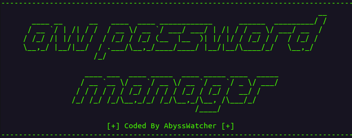

# AW Password Manager

AW Password Manager is a terminal based password manager developed in C++. The program is prepared to run in Linux. The usage on Windows is possible but before installing it you need to download some dependencies (cryptopp, figlet and g++). If the dependencies are downloaded is possible to compile and run the program but is recommended to have a Linux distro like Ubuntu for a proper experience.

## Context

In an era where digital security breaches are not just common but expected, the significance of having a strong, secure password cannot be overstated. Passwords are often the first line of defense in protecting personal, financial, and professional information from unauthorized access. Despite this, many individuals continue to use weak, easily guessable passwords, putting their digital lives at risk.

A secure password acts as a robust barrier against hackers and malicious software. It ensures that your private data remains confidential, safeguarding everything from your email accounts to bank details. However, creating and remembering complex passwords can be challenging. This is where our program steps in, offering a solution that not only generates strong, unique passwords for each of your accounts but also stores them in your pc.

The creation of the program has a unique goal, let to know the importance of using strong passwords and the importance of being cautious with them. Getting strong and secure passwords is important but encrypting them gives an extra security measure to avoid attacks.

## Technical Aspects

AW Password Manager can handle operations like:
- Creating password libraries in your pc
- Generating safe and random passwords
- Encrypting and decrypting the passwords that have been generated
- Visualizing your passwords

For security reasons the encryption and decryption aspects are reserved. Same happens with the password generation specifications.

## Installation

To use AW Password Manager you only need to download the program and compile it. You can use the bash script or you can compile it on your own. Is important to know that you will need a c/c++ compiler, cryptopp and figlet to use the program in its whole.

First create/go to the directory where you want to clone the repository

Then download the source code or clone the repository:

<b>git clone https://github.com/Julen-H/AWFileManager</b>

### Manual Compilation

In Linux you should have already installed the gcc compiler. If you don´t have it you can do this way:

<b>sudo apt update && sudo apt install build-essential</b>

Or you can do it like this:

<b>sudo apt-get update && sudo apt-get install g++ -y</b>

To install cryptopp you can use this command:

<b>sudo apt-get update && sudo apt-get install libcrypto++-dev libcrypto++-doc libcrypto++-utils -y</b>

Finally you can install figlet in this way:

<b>sudo apt-get update && sudo apt-get install figlet -y</b>

Once the dependecies are downloaded you will need to compile it:

- Compile it -> <b>g++ -c PasswordManager.cpp</b> and later <b>g++ -o AWPasswordManager main.cpp PasswordManager.o -lcryptopp</b>
- Run it -> <b>./AWPasswordManager</b>

### Bash Script

Give execution permissions:

<b>chmod +x AWPasswordManager.sh</b> 

Then execute it:

<b>./AWPasswordManager.sh</b>

Once is executed you can run it using the executable that will create the script (if you use the script every time you want to run the program the script will verify and try to install all the dependencies and will compile the program again):

<b>./AWPasswordManager</b>

